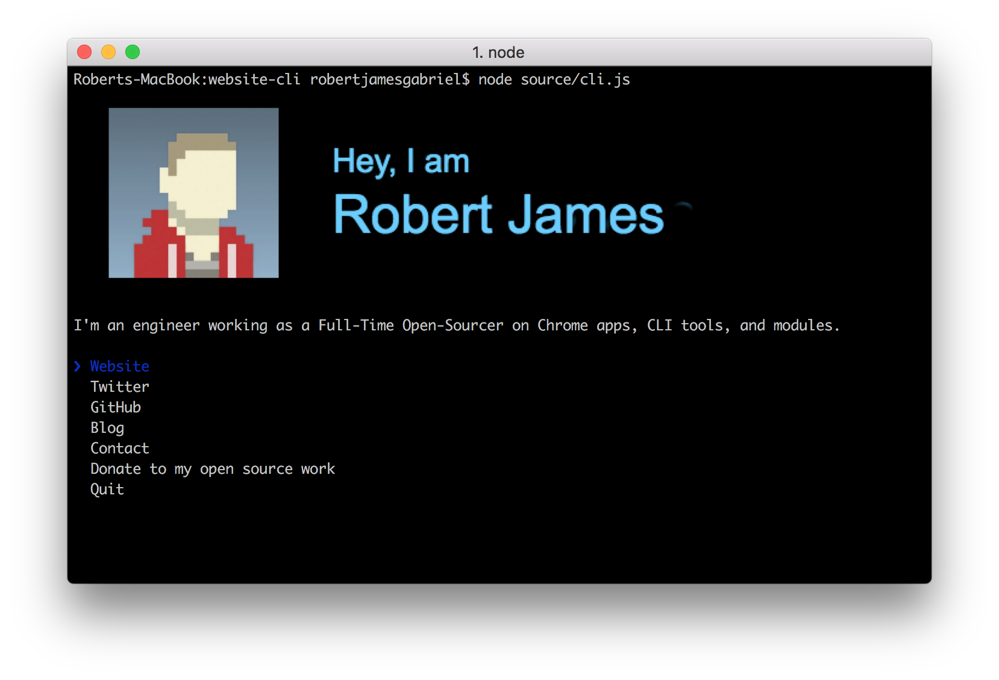

# robertgabriel [](https://travis-ci.org/robertjgabriel/robertgabriel)

> The [Robert James Gabriel](https://robertgabriel.ninja) CLI




## Usage

Install Node.js, then:

```
$ npx robertgabriel
```


## Built with

- [ink](https://github.com/vadimdemedes/ink) - React for interactive command-line apps
- [terminal-image](https://github.com/sindresorhus/terminal-image) - Display images in the terminal


All credit goes to Sindre Sorhus](https://sindresorhus.com) for the idea.
